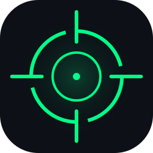

<div align="center">



# CrossOver-rs 🎯

**An ultra-lightweight, high-performance Crosshair Overlay for Linux (Wayland & X11) written in 100% pure Rust.**

*Inspired by and built with appreciation for the original [CrossOver](https://github.com/lacymorrow/crossover) by [Lacy Morrow](https://github.com/lacymorrow).*

[](https://github.com/hamedtareqhamed/crossover-rs/releases)
[](LICENSE)
[](https://github.com/hamedtareqhamed/crossover-rs)
[](https://github.com/hamedtareqhamed/crossover-rs)
[](https://github.com/hamedtareqhamed/crossover-rs)
[](#-anti-cheat-safety)

[**Quick Install**](#-quick-install) · [**Controls**](#-interactive-terminal-controller) · [**Crosshairs Library**](#-crosshairs--customization) · [**Credits**](#-credits--acknowledgments) · [**العربية**](#-دليل-الاستخدام-باللغة-العربية)

</div>

---

## ⚡ Why CrossOver-rs?

Traditional overlays built with Electron or heavy GUI toolkits consume hundreds of megabytes of RAM and induce input latency. **CrossOver-rs** was redesigned from scratch in Rust for Linux gamers who demand zero performance impact:

| Feature | Original Electron Overlays | **CrossOver-rs (Rust)** |
| :--- | :--- | :--- |
| **Binary Size** | ~150 - 180 MB | **`1.3 MB`** *(>99% smaller!)* |
| **RAM Usage** | ~200 - 350 MB | **`~8 MB`** |
| **Idle CPU Usage** | 1% - 3% | **`0.00%`** (Event-driven) |
| **Startup Time** | 2 - 4 seconds | **`< 20 milliseconds`** |
| **Dependencies** | Node.js + Chromium + GTK | **Zero external dependencies** (pure standalone binary) |
| **Input Pass-through** | Variable | **100% Click-through** (OS level) |

---

## 🎯 Crosshairs & Customization

CrossOver-rs gives you two levels of crosshairs:

1. **Procedural Vector Engine (7 Core Styles + Infinite Variations):**
   * **`Cross (+)`**: Standard 4-arm reticle with custom gap and thickness.
   * **`Dot (•)`**: Crisp center dot with configurable radius.
   * **`Circle (○)`**: Hollow circle reticle.
   * **`Circle + Dot (⦿)`**: Dual ring with inner aiming point.
   * **`Chevron (∧)`**: Tactical inverted V chevron.
   * **`Box (□)`**: Tactical squared reticle.
   * **`T-Style (T)`**: Unobstructed top-view crosshair.
   * *Every style supports:* Independent Center Dot, Outline, Alpha Opacity, Custom Colors (Hex RGB/RGBA), and Sub-pixel Size/Thickness/Gap adjustments.

2. **Built-in Vector Library (200+ Kenney SVG Reticles):**
   * High-precision tactical scopes, circles, dots, and chevron designs (licensed under CC0 Public Domain by Kenney.nl).

---

## 🚀 Quick Install

### One-liner (Fastest)
```bash
git clone https://github.com/hamedtareqhamed/crossover-rs.git
cd crossover-rs
./install.sh
```

Or install with Cargo:
```bash
cargo install --path .
```

---

## 🎮 How to Control

CrossOver-rs gives you two seamless ways to control your crosshair:

### 1. Interactive Terminal Controller (TUI)
Simply run `crossover` in any terminal:
```bash
crossover
```

```text
╔═══════════════════════════════════════════════════════════════════╗
║                    🎯 CROSSOVER CONTROLLER                        ║
║            Ultra-lightweight Linux Crosshair Overlay              ║
╠═══════════════════════════════════════════════════════════════════╣
║  Status:    🟢 ON (Visible)      Style:     Cross (+)             ║
║  Size:      24 px               Thickness: 2  px                  ║
║  Gap:       5  px               Color:     #00FF00                ║
║  Position:  [X: 0, Y: 0]       Message:   Ready                  ║
╠═══════════════════════════════════════════════════════════════════╣
║  [Space]     Toggle Visibility (Show / Hide)                      ║
║  [↑ ↓ ← →]   Move Crosshair (Nudge 1 Pixel)                       ║
║  [R]         Reset Position to Exact Center                       ║
║  [Tab]       Cycle Style (Cross, Dot, Circle, Chevron, Box...)    ║
║  [+ / -]     Increase / Decrease Size                             ║
║  [C]         Cycle Color (Green, Red, Cyan, Yellow, White...)     ║
║  [T]         Cycle Line Thickness                                 ║
║  [G]         Cycle Center Gap                                     ║
║  [D]         Detach (Keep overlay running in background & exit)   ║
║  [Q / Esc]   Quit & Close Overlay Completely                      ║
╚═══════════════════════════════════════════════════════════════════╝
```

* Press **`D` (Detach)** to close the terminal while keeping the overlay alive in the background!
* Press **`Q`** or **`Ctrl+C`** to close both the overlay and terminal.

---

### 2. CLI & Background Daemon

Start in background mode:
```bash
crossover -d &
```

Control from scripts or keyboard shortcuts:
```bash
crossover --toggle
crossover --style dot
crossover --color "#00ff88"
crossover --size 28
crossover --thickness 3
crossover --gap 6
crossover --nudge-up
crossover --nudge-down
crossover --reset
crossover --status
crossover --quit
```

---

## 🛡️ Anti-Cheat Safety

**CrossOver-rs is 100% safe and non-bannable:**
* ❌ **No DLL/SO injection:** It never hooks into games or graphics APIs (`VK_LAYER`, OpenGL, DirectX).
* ❌ **No memory reading:** It never accesses game memory or process memory (`/proc/<pid>/mem`).
* ❌ **No synthetic input:** It does not simulate or automate mouse clicks or aim movements (no aimbots or macros).
* ✅ **Pure Desktop Layer:** It runs as an independent top-level OS window drawn by your display server (Wayland Layer Shell / X11).

---

## 🎖️ Credits & Acknowledgments

* **Original Concept & Inspiration:** Huge thanks to **[Lacy Morrow](https://github.com/lacymorrow)** for creating the original **[CrossOver](https://github.com/lacymorrow/crossover)** project, which inspired this native Rust rewrite for Linux.
* **Vector Reticle Pack:** 200+ crosshairs created by **[Kenney](https://kenney.nl)** (licensed under **CC0 1.0 Universal - Public Domain**).

---

## 🇸🇦 دليل الاستخدام باللغة العربية

برنامج **CrossOver-rs** هو تطبيق شعيرة تصويب (Crosshair Overlay) مخصص لأنظمة لينكس مكتوب بلغة **Rust** بالكامل وبدون أي أطر واجهات ثقيلة، ومستوحى من المشروع الشهير CrossOver للمطور Lacy Morrow.

### المميزات الرئيسية:
* **حجم فائق الصغر:** ملف تنفيذي واحد بحجم **1.3 ميغابايت** فقط.
* **استهلاك موارد شبه منعدم:** ~8 ميغابايت رام و 0% معالج أثناء اللعب.
* **دعم كامل لـ Wayland و X11:** مع تمرير كامل للنقرات (100% Click-through).
* **مؤشرات وشعيرات متنوعة:** 7 أنماط فيكتورية مدمجة مع إمكانية تعديل الحجم والسمك واللون والفراغ الداخلي بدقة بكسل بكسل، بالإضافة لمكتبة تضم أكثر من 200 شعيرة SVG من حزمة Kenney العامة.
* **وضع تحكم تفاعلي مباشر من الطرفية (TUI):** مع ميزة **`D` (Detach)** للخروج وترك الشعيرة تعمل في الخلفية.
* **أوامر CLI سريعة:** للربط باختصارات النظام ولوحة المفاتيح.
* **آمن تماماً من الحظر (Anti-Cheat Safe).**

---

## 📄 License
This project is licensed under the [GNU General Public License v3.0 (GPL-3.0)](LICENSE).
